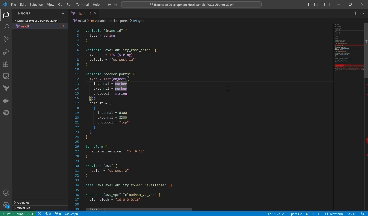

# terraform-order README

TERRAFORM-ORDER is a plugin aimed make terraform code easier for the IaC with TF. It was first created to create an ordering feature to order variables in alphabetical order, but it will also offers variable tracking, replacement and other functionalities that helps developers to improve the code experience.

## Features

This plugin offers some features as sorting feature, which is 

## Requirements

No requirements.

<!-- ## Extension Settings

Include if your extension adds any VS Code settings through the `contributes.configuration` extension point.

For example:

This extension contributes the following settings:

* `myExtension.enable`: enable/disable this extension
* `myExtension.thing`: set to `blah` to do something -->

## Known Issues
No issues for now

## Release Notes

### 0.0.1

Initial release of Terraform-order

